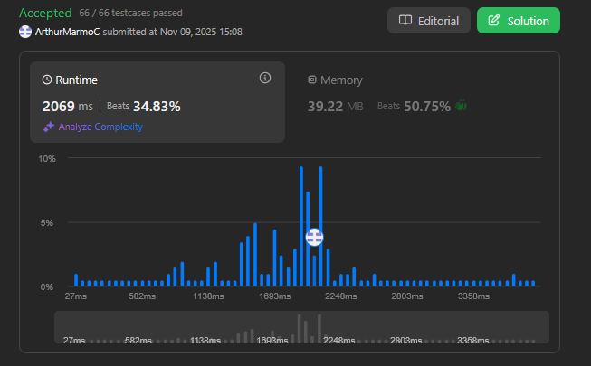

# Dividir e Conquistar - LeetCode

**Conteúdo do Trabalho**: Algoritmos de Dividir e Conquistar 

## Alunos
|Matrícula | Aluno |
| -- | -- |
| 211043610  |  Arthur Marmo Cathalá |
| 211061574  |  Danielle Rodrigues Silva |

## Sobre 
Nesse projeto apresentamos soluções de exercícios do Leetcode usando Python.

## Screenshots das Submissões

### 1 - Difícil - [Count of Smaller Numbers After Self](https://leetcode.com/problems/count-of-smaller-numbers-after-self/description/)

### 2 - Difícil - 

### 3 - Difícil -  

[Solução]()

### 4 - Difícil -  

[Solução]()

## Vídeo de apresentação do Trabalho 3

[Vídeo da apresentação no yt]()

## Linguagens

Python

## Uso

Rode os códigos no site do [LeetCode](https://leetcode.com/), em cada um dos problemas.

