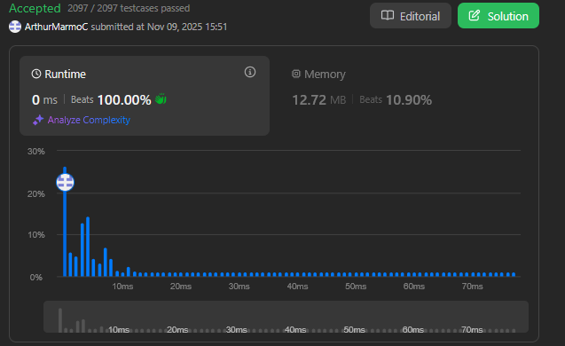
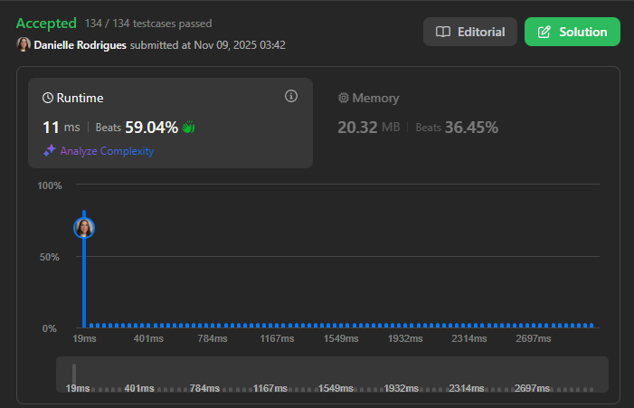
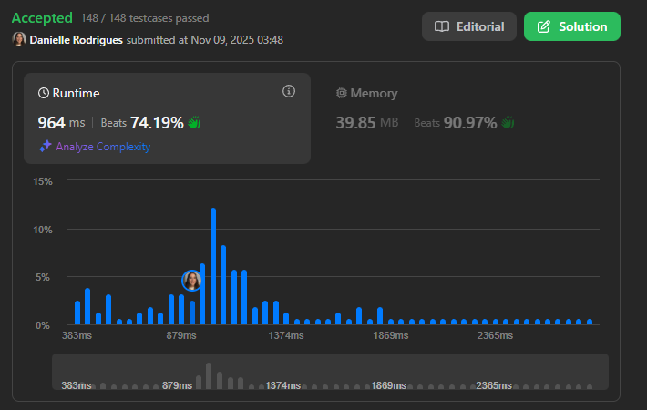

# Dividir e Conquistar - LeetCode

**Conteúdo do Trabalho**: Algoritmos de Dividir e Conquistar 

## Alunos
|Matrícula | Aluno |
| -- | -- |
| 211043610  |  Arthur Marmo Cathalá |
| 211061574  |  Danielle Rodrigues Silva |

## Sobre 
Nesse projeto apresentamos soluções de exercícios do Leetcode usando Python.

## Screenshots das Submissões

### 1 - Difícil - [Count of Smaller Numbers After Self](https://leetcode.com/problems/count-of-smaller-numbers-after-self/description/)

[Solução](CountOfSmallerNumbersAfterSelf.py)

### 2 - Difícil - [Median of Two Sorted Arrays](https://leetcode.com/problems/median-of-two-sorted-arrays/description/)

[Solução](MedianOfTwoSortedArrays.py)

### 3 - Difícil - [Merge k Sorted Lists](https://leetcode.com/problems/merge-k-sorted-lists/description/) 

[Solução](./MergeKSortedLists.py)

### 4 - Difícil - [Count Good Triplets in an Array](https://leetcode.com/problems/count-good-triplets-in-an-array/description/) 

[Solução](./CountGoodTripletsInAnArray.py)

## Vídeo de apresentação do Trabalho 3

[Vídeo da apresentação no yt](https://youtu.be/j9S6l2LKbHM)

## Linguagens

Python

## Uso

Rode os códigos no site do [LeetCode](https://leetcode.com/), em cada um dos problemas.

